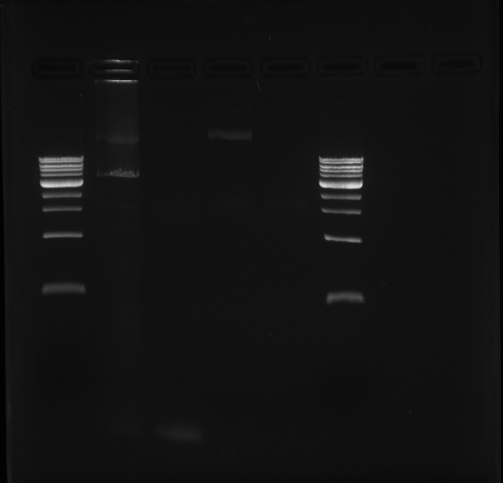

# Goals

1. Generate mutant Victoria PB2 using random mutagenesis.

# Experiment Design

1. Amplify pCI using primers EM-15 and EM-6, use Phusion GC master mix.
1. Amplify Victoria PB2 using primers EM-2 and EM-11, use GeneMorph II enzyme.

# Key Protocol Steps

## PCR Preparation and Reaction

### pCI backbone PCR for Gibson Assembly

#### Preparation

Two reactions - one sample (named "pCI") and one negative control (named "NC").

Reagent | Volume (µL) | Master Mix Volume x2.2 (µL)
--------|-------------|----------------------------
(fw primer 10 mM) EM-15   | 1.0         | 2.2
(re primer 10 mM) EM-6    | 1.0         | 2.2
(template) VicPB2 in pCI| 1.0    | N/A
Phusion master mix| 10.0 | 22.0
Water   | 7.0         | 15.4
**Total:** | **20.0** | **41.8**

#### PCR Protocol

Temperature (ºC) | Time (min, sec) | cycles
------|-------|-----
98 | 0, 30 | 1
98 | 0, 5  | repeat
67 | 0, 30 | 35
72 | 2, 00 | cycles
72 | 5, 00 | 1
4  | hold  | n/a

Expect a single band at approx. 4 kb.

### VicPB2 mutagenesis PCR

#### Preparation

Total of two reactions - one for sample (named "VicPB2") and one negative control (named "mut NC" to distinguish from pCI's negative control).

First off, mix 2 µL each of 10 mM EM-2 and EM-11 to create the "primer mix".

Reagent | Volume (µL) | Master Mix Volume (x2.2) (µL)
--------|-------------|----------
Reaction Buffer | 5.0 | 11.0
dNTP | 1.0 | 2.2
GeneMorph II enzyme | 1.0 | 2.2
VicPB2 in pCI | 1.0 | N/A
Primer mix | 0.5 | 1.1
Water | 41.5 | 91.3
**Total:** | **50.0** | **107.8**

Some notes:
1. Target input volume was computed to be 3.25 µL in order to get 1000 ng of DNA. However, I only added 1 µL because of laziness. Next time round, I will make sure I have a program to compute this report in its entirety.

#### PCR Protocol

Temperature (ºC) | Time (min, sec) | cycles
------|-------|-----
95 | 2, 00 | 1
95 | 0, 30 | repeat
58 | 0, 30 | 4
72 | 2, 30 | cycles
72 | 10, 00 | 1
4  | hold   | n/a

Some notes:

1. Though I calculated that the mutagenesis protocol only needed 3 cycles, I decided to go for 4 just to increase the chance that we get extra mutants present. 4 cycles represents 24 = 16-fold amplification, which puts this reaction on the lower end of medium amplification (according to the GeneMorph II manual).

Expect a single band at approx. 2.4 kb.

## Load Gel

Agarose:

- 60 mL TBE
- 0.6 g Agarose
- 6 µL EtBr

Loading gel:

- pCI:
  - 5 µL PCR rxn
  - 1 µL RediLoad
- VicPB2:
  - 10 µL rxn
  - 1 µL RediLoad

Gel order:

1. 1 kb ladder
1. pCI
1. NC
1. VicPB2
1. mutNC
1. 1 kb ladder

# Results - pass 1

No bands on PCR.

Likely because the entire PB2 is difficult to amplify.

That's okay, I have backup primers for splitting the PCRs into two. Will attempt next week.
