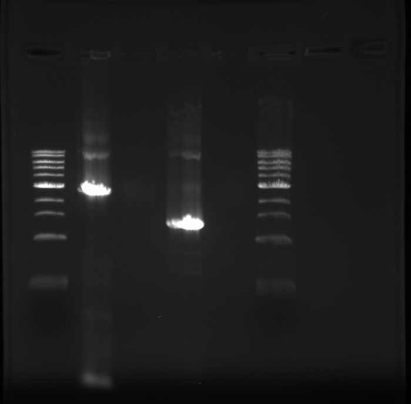

# Goals

1. [ ] Amplify just pCI in fragments, see if this reaction works or not.

# Experiment setup

- Part 1:
  - Fw primer: EM-15
  - Re primer: EM-14
  - PCR product size: 2693 bp
- Part 2:
  - Fw primer: EM-7
  - Re primer: EM-6
  - PCR product size: 1360 bp

Tube order (left to right):

1. Part 1 (labelled "P1")
1. Water-only control (labelled "W")
1. Part 2 (labelled "P2")
1. Template-only control (labelled "T")

4 PCR reactions - therefore make 4.4X master mix of 50 µL reactions. (I am going for 50 µL this time round because there was very little to work with using 20 µL reactions.)

## PCR setup

Reagent | 1 rxn (µL) | MM x4.4
-----|------|-------
Phusion GC | 25 | 110
Template | 1 | N/A
Fw primer | 2.5 | N/A
Re primer | 2.5 | N/A
Water | 19 | 83.6
**Total:** | **50** | **193.6**

## PCR protocol

Temperature (ºC) | Time (min, sec) | cycles
------|-------|-----
98 | 0, 30 | 1
98 | 0, 5  | repeat
67 | 0, 30 | 35
72 | 1, 30 | cycles
72 | 5, 00 | 1
4  | hold  | n/a

## Gel

1% (w/v) agarose gel:
- 50 mL 1X TBE
- 0.5 g LE Agarose
- 5 µL EtBr

150 V, 30 min.

# Results

Both parts come out with the correct band sizes, but they are not the only bands present. I will need to gel purify the larger PCR reaction.
