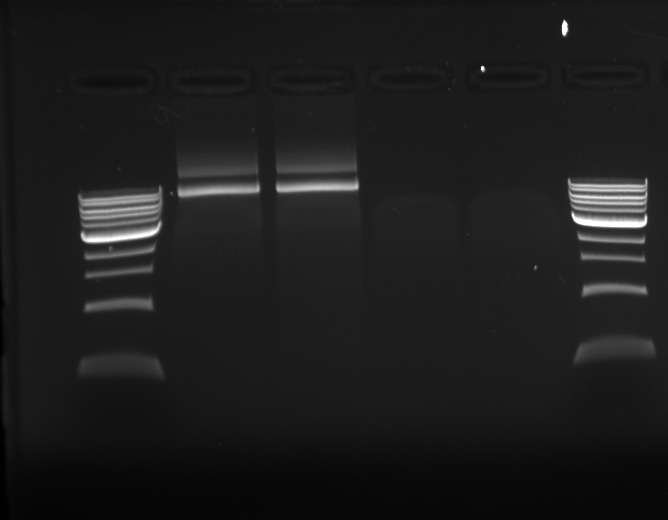

## Goals

- Generate mutant PB2 PCR products using Agilent GeneMorph II kit.

## Key Protocol Steps

### PCR

**Samples:**

- Template: Victoria PB2
  - Part 1:
    - Fw primer: EM-11, 64ºC
    - Re primer: EM-10, 62ºC
    - 1586 bp product size
  - Part 2:
    - Fw primer: EM-3, 63ºC
    - Re primer: EM-2, 62ºC
    - 806 bp product size
- PCR tube samples:
  - P1: Part 1
  - P2: Part 2
  - W: Water-only control
  - T: Template-only control

**Preparation:**

- First mix 2 µL of Fw + Re primers together.

**Master Mix:**

Reagent         | 1 rxn (µL) | MMx4.4 (µL)
----------------|------------|------------
Rxn Buffer      | 5.0        | 22
dNTP            | 1.0        | 4.4
enzyme          | 1.0        | 4.4
water           | 39.25      | 172.7
fw + re primers | 0.5        | N/A
tempate         | 3.25       | N/A

Per tube: 46.25 µL of master mix.

**Thermocycler Protocol:**

T/ºC | Time (min, sec) | cycles
-----|-----------------|-------
95   | 2, 00           | 1
95   | 0, 30           | repeat
57   | 0, 30           | 30
72   | 2, 00           | cycles
72   | 10, 00          | 1
4    | hold            | n/a

Notes for future reference:

- The last time round I did 4 cycles of amplification. Something told me that this was off, but I couldn't pin down why. This time round, I checked the protocol manual, and it said 30X amplification, even for low target amount of mutagenesis.
- Agilent's enzyme works at 1 min/kb.

**Gel**

1% (w/v):
- 100 mL 1X TBE
- 1g LE Agarose
- 10 µL EtBr

Loading dye: 2 µL RediLoad + 10 µL PCR product (yes, it's 2x the concentration, but it's okay, not crucial).

Order of reactions (left to right):
1. 1 kb ladder
1. P1 (part 1)
1. P2 (part 2)
1. W (water-only control)
1. T (template-only control)
1. 1 kb ladder

Notes:
- This PCR reaction has most certainly failed.
- Gel has a single band high up at ~8 kb. This is bigger than the size of the plasmid. Something is being amplified as a concatenation, I think.
- It is unclear to me why, given two different primer pairs, the PCR product should come out the same. Let me first quickly check that the primer sequences are different... And yes, they are.
-
