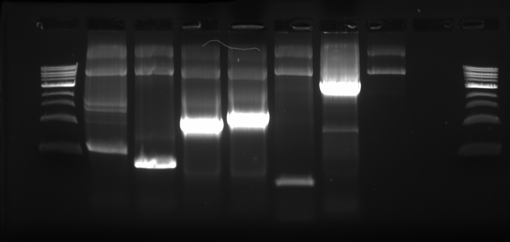

## Goals

- I just realized that Islam has a set of primers that he's used to successfully clone the VicPB2 into pCI. I might as well leverage that to see if his primer pairs work.
- Therefore, the goal of this experiment is to see whether I can get correctly-sized amplicons using a combination of Islam's primers and my own primers.

## Setup

- My primer sets:
  - EM-11 + EM-10: 1.6kb
  - EM-3 + EM-2: 0.8 kb
  - This reaction pair has failed before, it should fail again this time round.
- Islam's primer sets:
  - Nhe_Fw + Int_Re: ~1.3 kb
  - Int_Fw + Kpn_Re: ~1.1 kb
  - This reaction pair has worked before, and it should work this time round.
- Mixed primer sets:
  - EM-11 + Int_Re: ~1.3 kb
  - Int_Fw + EM-2: ~1.1 kb
  - This reaction pair is what I hope should work, in which case I will use it to mutate the PB2 protein.

I received 100 mM stock primers from Islam, and I made 10 mM dilutions of them.

These are the primer sequences for Islam's primers:
- Nhe_Fw: `5'-AGTCAAGCTAGCATGGAAAGAATAAAAGAACTACGG-3'`
- Kpn_Re: `5'-AGACATGGTACCTTAATTGATGGCCATCCGAATTC-3'`
- Int_Fw: `5'-GATATATGCAAGGCTGCAATG-3'`
- Int_Re: `5'-CAATCTTCTGGTTGCTTTTCTTAG-3'`

## PCR Setup

Sample ID | Fw Primer | Re Primer | Template | Expected kb
----------|-----------|-----------|----------|------------
1         | EM-11     | EM-10     | pCI-PB2  | 1.6 (\*)
2         | EM-3      | EM-2      | pCI-PB2  | 0.8 (\*)
3         | Nhe_Fw    | Int_Re    | pCI-PB2  | 1.3
4         | Int_Fw    | Kpn_Re    | pCI-PB2  | 1.1
5         | EM-11     | Int_Re    | pCI-PB2  | 1.3
6         | Int_Fw    | EM-2      | pCI-PB2  | 1.1
T         | N/A       | N/A       | pCI-PB2  | N/A
W         | N/A       | N/A       | N/A      | N/A

(\*) These reactions are expected to fail.

## Master Mix

Reagent    | 1 rxn (µL) | MM x8.8
-----------|------------|---------
MyTaq Red  | 10         | 88
Water      | 7          | 61.6
Fw         | 1          | N/A
Re         | 1          | N/A
Template   | 1          | N/A
**Total**  | **20**     | **127.6**

Aliquot 17 µL master mix per tube.

## PCR Protocol

Temperature (ºC)  |  Time (min, sec)  | Cycles  
------------------|-------------------|--------
95                | 1, 00             | 1
95                | 0, 15             | repeat
50                | 0, 15             | 35
72                | 1, 00             | cycles
72                | 10, 00            | 1
4                 | hold              | 1

**Note:** This time round, I opted to do 50ºC annealing temperature, because the primers that Islam used had meting temperatures of 52ºC. This is still on the high side, but it's a balance because other primers have melting temperatures in the 60+ºC range.

## Gel

Used a pre-made 1% (w/v) gel with EtBr.

Sample order (from left to right):

- 1 kb ladder
- P1
- P2
- P3 - Islam's primer pair
- P4 - Islam's primer pair
- P5
- P6
- Template-only control
- Water control
- 1 kb ladder

As shown here, Islam's primer pair works as expected, with the ~1 kb pairs of bands showing up brightly (lanes P3, P4). I had expected the same set of bands to show up in the mixed PCR (lanes P5, P6), but this did not show up as such. I suspect that my outer primers (EM-2 and EM-11) are faulty.

I will order 60-mers to try out instead; 40-mers might not be long enough (maybe?). This means I do have to ignore EM-17 to EM-24, which are all 40-mers; they may be leveraged later on for other stuff.
