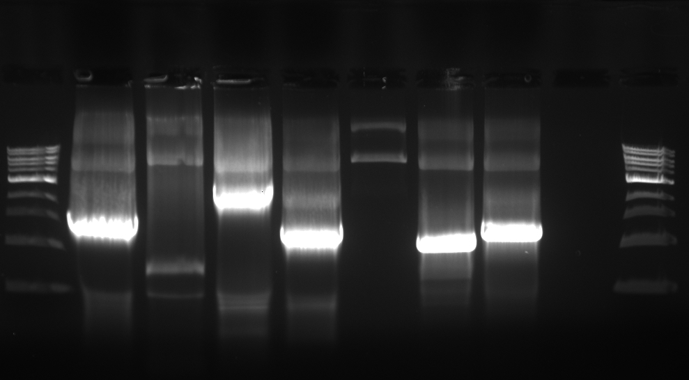

## Goals

I have ordered a new set of 60-mer primers (EM-27-36, inclusive). Prior to using them for mutagenesis, I am going to test them to make sure that they work using the MyTaq Red PCR master mix.

## Setup

**PCR reactions:**

(Below is copied from the Jupyter notebook.)

    A/Victoria/361/2011|KJ942687_part1
      Primer: fw_gibson
      Primer ID:  EM-30
      Tm:         66.6ºC
      Primer: re_gibson
      Primer ID:  EM-29
      Tm:         69.3ºC
      Size:       1600 bp

    A/Victoria/361/2011|KJ942687_part2
      Primer: fw_gibson
      Primer ID:  EM-28
      Tm:         69.7ºC
      Primer: re_gibson
      Primer ID:  EM-27
      Tm:         67.3ºC
      Size:       820 bp

    pCI_part1
      Primer: fw_gibson
      Primer ID:  EM-32
      Tm:         76.4ºC
      Primer: re_gibson
      Primer ID:  EM-31
      Tm:         74.6ºC
      Size:       2707 bp

    pCI_part2
      Primer: fw_gibson
      Primer ID:  EM-26
      Tm:         75.3ºC
      Primer: re_gibson
      Primer ID:  EM-25
      Tm:         67.5ºC
      Size:       1374 bp

## PCR Setup

| Tube # | Rxn                   | Fw     | Re     | Template | bp    |
|--------|-----------------------|--------|--------|----------|-------|
| 1      | PB2 Part 1            | EM-30  | EM-29  | VicPB2   | 1600  |
| 2      | PB2 Part 2            | EM-28  | EM-27  | VicPB2   | 820   |
| 3      | pCI Part 1            | EM-32  | EM-31  | VicPB2   | 2707  |
| 4      | pCI Part 2            | EM-26  | EM-25  | VicPB2   | 1374  |
| T      | template-only control | N/A    | N/A    | VicPB2   | N/A   |
| PC1    | Pos Control 1         | Nhe_Fw | Int_Re | VicPB2   | ~1300 |
| PC2    | Pos Control 2         | Int_Fw | Kpn_Re | VicPB2   | ~1100 |
| W      | water-only control    | N/A    | N/A    | N/A      | N/A   |

## Master Mix

| Reagent   | 1 Rxn | MM x8.8 |
|-----------|-------|---------|
| MyTaq Red | 10    | 88      |
| Water     | 7     | 61.6    |
| Fw        | 1     | N/A     |
| Re        | 1     | N/A     |
| Template  | 1     | N/A     |

## PCR Program

Temperature (ºC)  |  Time (min, sec)  | Cycles  
------------------|-------------------|--------
95                | 1, 00             | 1
95                | 0, 15             | repeat
64                | 0, 15             | 40
72                | 2, 00             | cycles
72                | 10, 00            | 1
4                 | hold              | 1

## Gel

Used pre-cast 1% gel, made as per previous runs.

Order of samples is exactly the same as the PCR setup.

Analysis of gel:
- PB2 Part 1: The band size (between 1-1.5 kb) is small, expected 1600 bp, but I have a hunch it's still correct.
- PB2 Part 2: Correct band size (between 0.5 and 1 kb, expected 820 bp). Need to optimize reaction for yield.
- pCI Part 1: Correct band size (between 2-3 kb; expected 2707 bp).
- pCI Part 2: Correct band size (between 1 and 1.5 kb)
- Template-only: no comment. Consistent with previous runs.
- PC1 & PC2: The band sizes look swapped. I must have done something wrong with the order of samples. I am confident that I added the primers correctly, though. 
