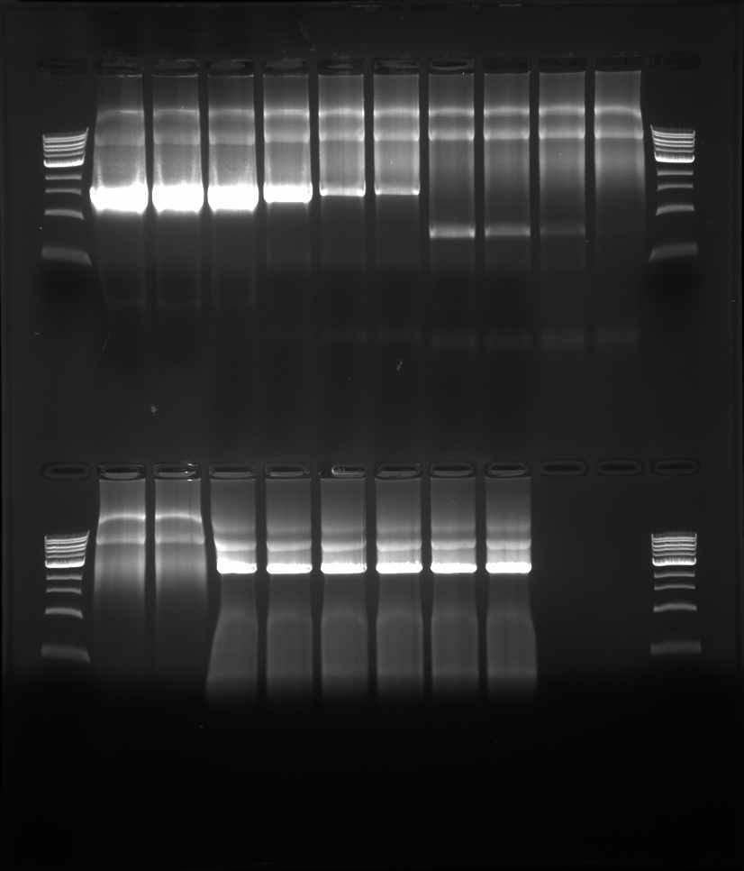

## Goals

- Identify the right annealing temperature for the primers.
  - pCI: what is the right Tm for the primers when amplified using Phusion?
  - PB2: same question, except using MyTaq (proxy for agilent enzyme)

## Setup

We do the following reactions:

1. PB2 Part 1
1. PB2 Part 2
1. pCI Part 1
1. pCI Part 2
1. MyTaq Water-only control
1. MyTaq template-only control
1. Phusion water-only control
1. Phusion template-only control

Note to future self: though the reactions use up a lot of enzyme, it's the surest way to check for contaminations and the like, as I'm ensuring that the reactions I'm interested in are set up exactly the same as the controls.

## PCR Layout

In this case, I'm using a 96-well plate.

| Col: Temp/ºC Row: Sample ID | 62 | N/A | 64 | N/A | 66 | N/A | 68 | N/A | 70 | N/A | 72 | N/A |
|:---------------------------:|:--:|:---:|:--:|:---:|:--:|:---:|:--:|:---:|----|-----|----|-----|
|        A: PB2 Part 1        |    |     |    |     |    |     |    |     |    |     |    |     |
|        B: PB2 Part 2        |    |     |    |     |    |     |    |     |    |     |    |     |
|        C: pCI Part 1        |    |     |    |     |    |     |    |     |    |     |    |     |
|        D: pCI Part 2        |    |     |    |     |    |     |    |     |    |     |    |     |
|     E: MyTaq water-only     |    |     |    |     |    |     |    |     |    |     |    |     |
|    F: MyTaq template-only   |    |     |    |     |    |     |    |     |    |     |    |     |
|    G: Phusion water-only    |    |     |    |     |    |     |    |     |    |     |    |     |
|   H: Phusion template-only  |    |     |    |     |    |     |    |     |    |     |    |     |

## PCR Setup

I have to make a total of 8 master mixes, one for each row in the sample layout.

| Reagent                      | 1 rxn | MM x6.6 |
|------------------------------|-------|---------|
| 2X MyTaq or Phusion GC       | 10    | 66      |
| Water                        | 7     | 46.2    |
| Fw (or H2O for W &T ctrls)   | 1     | 6.6     |
| Re (or H2O for W &T ctrls)   | 1     | 6.6     |
| Template (or H2O for T ctrl) | 1     | 6.6     |
| Total                        | 20    | 132     |

## Primer Table

| PCR Rxn       | Fw/Re  | expected size |
|---------------|--------|---------------|
| 1: PB2 Part 1 | 30, 29 | 1600          |
| 2: PB2 Part 2 | 28, 27 | 820           |
| 3: pCI Part 1 | 32, 31 | 2707          |
| 4: pCI Part 2 | 26, 25 | 1374          |

Note to self: Fw/Re numbers refer to primers in my catalogue, EM-25 to EM-30.

Note to self: All of the controls - I don't expect a band to be present.

## Gel

I made a 100 mL 1% gel (w/v) with 10 µL EtBr added. Three gels are needed in total.

- Gel 1 contains rows A-C. Samples are loaded from left to right.
- Gel 2 contains rows D-H. Samples are loaded from left to right.

Gel 1:

- Row 1:
  - Lanes 1-6: PB2 Part 1, 62ºC-72ºC
  - Lanes 7-10: PB2 Part 2, 62ºC-68ºC
- Row 2:
  - Lanes 1-2: PB2 Part 2, 70ºC-72ºC
  - Lanes 3-8: pCI Part 1, 62ºC-72ºC

Interpretation of gel: let's take a look at whether there's an optimal temperature for each PCR reaction.

PB2 Part 1: 68ºC
PB2 Part 2: <62ºC. For future use, hedge and just use 58ºC.
pCI Part 1: All work, use 68ºC.
