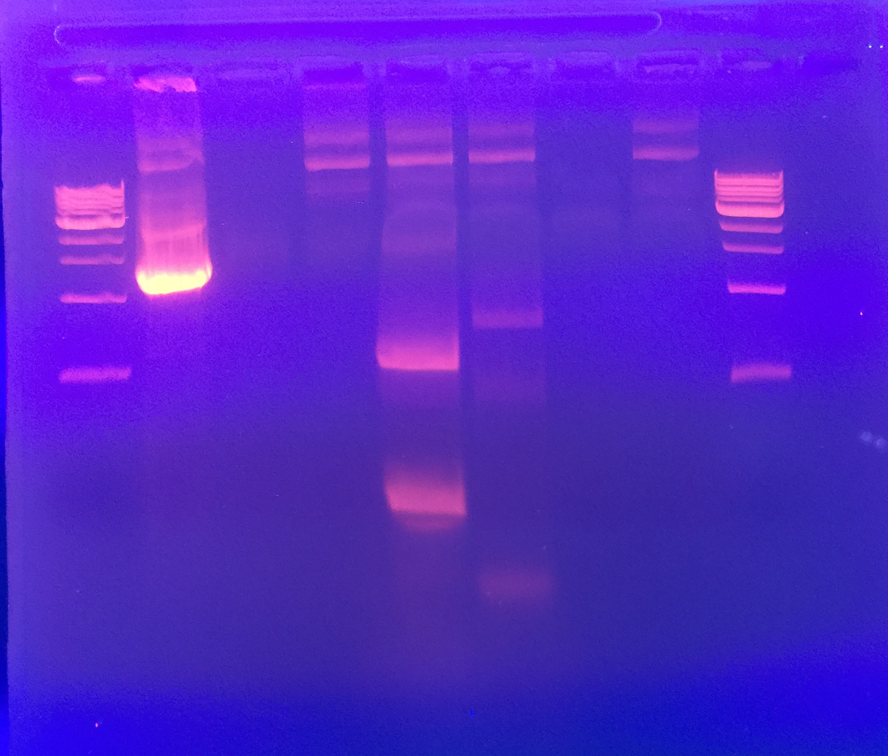

## Goals

- Generate mutant PB2 PCR products as well as generate pcI backbone PCR products
- Resolve problems from [previous mutagenesis](./20160831-mutagenesis.md) - changes are bolded

## Setup

### Reactions:

1. PB2 w/ Agilent (4 rxns)
2. pCI w/ Phusion (3 rxns)

**PB2**

| PCR Mix    | 1 rxn | Master Mix (4.4x) |
|------------|-------|-------------------|
| Water      | 41.5  | 182.6             |
| 10x buffer | 5     | 22                |
| 40 mM dNTP | 1     | 4.4               |
| F Primer   | 1     | N/A               |
| R Primer   | 1     | N/A               |
| Polymerase | 1     | **N/A***               |
| Template   | 1     | N/A               |
| Total      | 51.5  | 213.4             |

| Reaction      | Primers      | PCR Tube Label |
|---------------|--------------|----------------|
| PB2 Part 1    | EM-30, EM-29 | A1             |
| PB2 Part 2    | EM-28, EM-27 | A2             |
| Water-only    | N/A          | AW             |
| Template-only | N/A          | AT             |

*Added polymerase to each reaction separately after primers

**pCI**

| PCR Mix    | 1 rxn | Master Mix (3.3x) |
|------------|-------|-------------------|
| Water      | 22    | 72.6              |
| 2x Phusion** | 25    | 82.5               |
| Template   | 1     | N/A               |
| F Primer   | 1     | N/A               |
| R Primer   | 1     | N/A               |

| Reaction      | Primers      | PCR Tube Label |
|---------------|--------------|----------------|
| pCI Part 2    | EM-26, EM-25 | P2             |
| Water-only    | N/A          | PW             |
| Template-only | N/A          | PT             |

**Contains buffer, dNTPs, and DNA polymerase

**Note on prep**
- Phusion is much more resilient than Agilent and does not need to be put on ice
- Avoid touching inside of tube caps

### PCR Programs

**Agilent**

| Temperature (C)      | Time           | # cycles |
|----------------------|----------------|----------|
| 95                   | 2 min          | 1        |
| 95                   | 30 s           | Repeat   |
| **A1: 62, A2: 50**       | 30s            | 35       |
| 72                   | 2 min          | times    |
| 72                   | 10 min         | 1        |
| 4                    | hold           |          |

**Phusion**

| Temperature (C) | Time            | # cycles |
|-----------------|-----------------|----------|
| 95              | 30 s            | 1        |
| 95              | 15 s            | Repeat   |
| 68              | 15 s            | 35       |
| 72              | 2 min           | times    |
| 72              | 7 min           | 1        |
| 4               | hold            |          |

### Gel Electrophoresis

Gel Parameters
- 1% (w/v), 50 mL TBE
- 150 volts, 35 min

Gel Order

| Ladder | P2 | PW | PT | A1 | A2 | AW | AT | Ladder |
|--------|----|----|----|----|----|----|----|--------|

## Analysis

**Expected Sizes**

| Fragment        | expected size | successful?|
|-----------------|---------------|------------|
| A1: PB2 Part 1  | 1600          | No...      |
| A2: PB2 Part 2  | 820           | Faint      |
| P2: pCI Part 2  | 1374          | YES       |

- **A1**: The two brightest bands are at smaller sizes than expected, indicating fragmentation. A much fainter band between the 1.5 and 2.0 reference bands could represent DNA of the expected size.
- **A2**: The brightest band is between the 0.5 and 1.0 kb reference bands, so DNA strand of expected size is likely. However, band is still faint.
- **P2**: The band is between the 1.0 and 1.5 kb reference bands as expected.

Since pCI part 1 was successfully produced despite having the largest size at 2.7kb, perhaps we could try PCR with the whole PB2 fragment instead of splitting it?

## Gel Extraction

All three bands were cut and the DNA within extracted.

Notes/deviations from protocol:

Masses of gels:
- A1: 1.0578 - 1.004 = .0538
- A2: 1.0322 - .984 = .0482
- P2: 1.0833 - .988 = .0953

- Final elution vol: 10 µL

Sample stored in cloning kit, -20ºC.

**Nanodrop Analysis:**

| Fragment        | Concentration (ng/ul)| 260/280|
|-----------------|---------------|------------|
| A1: PB2 Part 1  | 10.7       | 8.92    |
| A2: PB2 Part 2  |2.1           | -0.6     |
| P1: pCI Part 1  | 229         | 1.53       |
| P2: pCI Part 2  | 83.4          | 1.96       |
