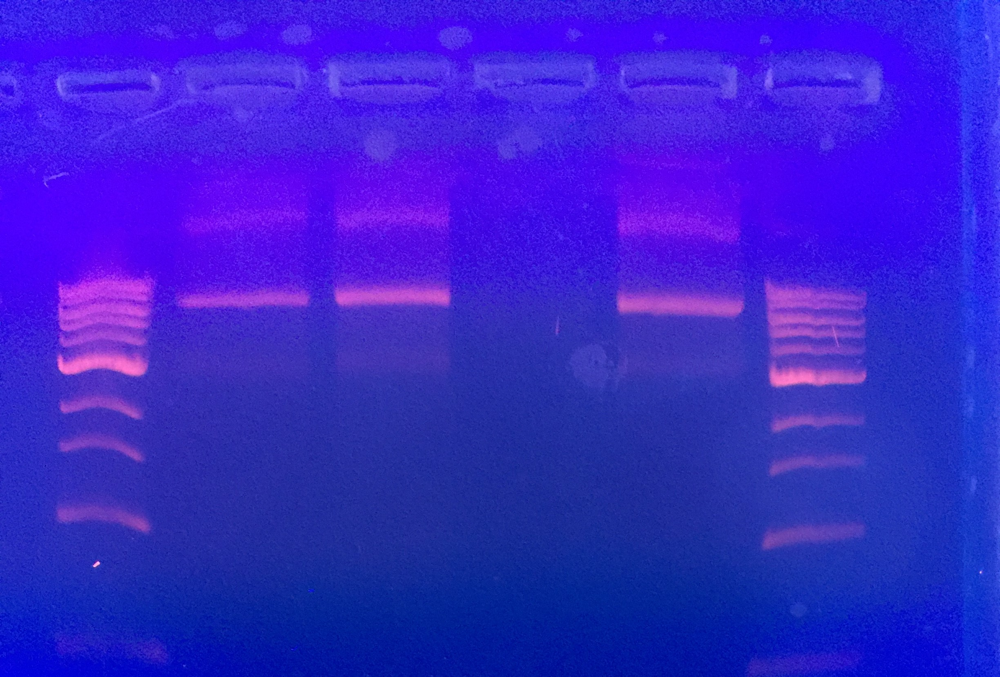

## Goals

- Test viability of PCR with full PB2 primers, with MyTaq Red substituting for Agilent
- This was done just to check whether it would work or not.

## Setup

### Reactions

1. PB2 @ 68C
1. PB2 @ 62C
1. Water-only
1. Template-only

| PCR Mix      | 1 rxn | Master Mix (4.4x) |
|--------------|-------|-------------------|
| Water        | 22    | 96.8              |
| 2x MyTaq Red | 25    | 110               |
| Template     | 1     | N/A               |
| F Primer     | 1     | N/A               |
| R Primer     | 1     | N/A               |

| Reaction      | Primers      | PCR Tube Label |
|---------------|--------------|----------------|
| PB2 @ 68C     | EM-30, EM-27 | Hi             |
| PB2 @ 62C     | EM-30, EM-27 | Lo             |
| Water-only    | N/A          | W             |
| Template-only | N/A          | T             |

### PCR Programs

| Temperature (C)       | Time           | # cycles |
|-----------------------|----------------|----------|
| 95                    | 1 min          | 1        |
| 95                    | 15 s           | Repeat   |
| Hi: 68, Lo: 62        | 15 s           | 40       |
| 72                    | 2 min          | times    |
| 72                    | 10 min         | 1        |
| 4                     | hold           |          |

### Gel Electrophoresis

Gel Order:

| Ladder | Hi | Lo | W | T | Ladder |
|--------|----|----|---|---|--------|

## Analysis

Full PB2 reaction did not produce desired 2.4 kb band.
