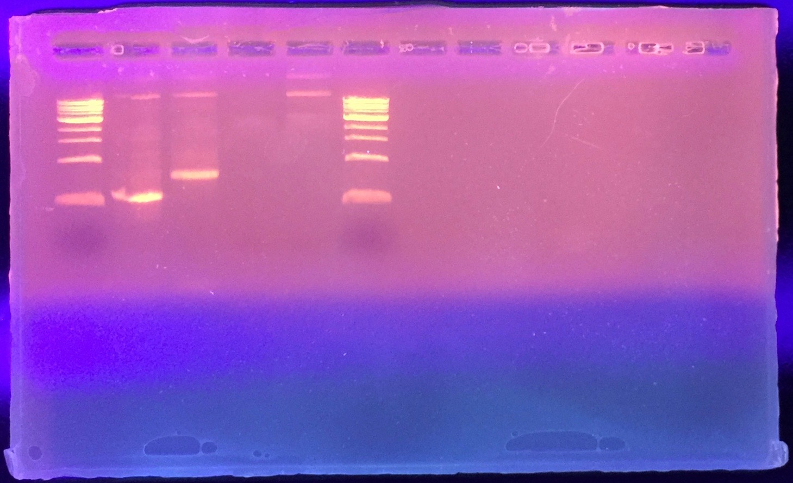
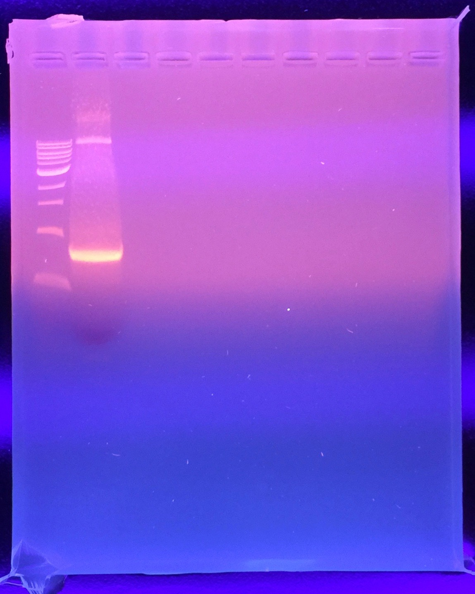

## Prior Work

- Previous rounds of mutagenesis using the agilent enzyme yielded very little product.
  - [Round 1](./20160831-mutagenesis.md) - no bands
  - [Round 2](./20160902-mutagenesis-2.md) - reduced annealing temperature by 6ºC, faint bands showed up, but also non-specific annealing showed up.

## Goals

- Test to see if 2% DMSO works to increase specificity of PCR reaction, and hence amount of reaction product.
  - Concurrently increase the number of reaction cycles to 40.

## PCR Setup

| Reaction        | Fw/Re        | Annealing Temp | Band Size |
|-----------------|--------------|----------------|-----------|
| PB2 Part 1 (A1) | EM-30, EM-29 | 62ºC           | 1600      |
| PB2 Part 2 (A2) | EM-28, EM-27 | 50ºC           | 820       |
| Water-only      | N/A          | 50ºC           | N/A       |
| Template-only   | N/A          | 50ºC           | N/A       |

## Reaction Master Mix

| Reagent      | 1 Rxn (µL) | MM x4.4 (µL) |
|--------------|------------|--------------|
| Water        | 39         | 171.6        |
| 10X Buffer   | 5          | 22           |
| 40 mM dNTP   | 1          | 4.4          |
| Fw primer    | 1          | N/A          |
| Re primer    | 1          | N/A          |
| Polymerase   | 1          | 4.4          |
| 100% DMSO    | 1          | 4.4          |
| Template     | 1          | N/A          |
| **Total Volume** | **50** | **206.6**    |

## PCR Program

| Temperature (C)      | Time           | # cycles |
|----------------------|----------------|----------|
| 95                   | 2 min          | 1        |
| 95                   | 30 s           | Repeat   |
| Variable (see PCR setup)| 30 s        | 40       |
| 72                   | 2 min          | times    |
| 72                   | 10 min         | 1        |
| 4                    | hold           | 1        |

## Gel

1% agarose gel (w/v), 150V, 30 min.

I first loaded 5µL of the total reaction volume. This was because the gel looked a bit shallow to load the full 50 µL (call this the "analytical gel"). I then prepared another 1% agarose gel with deeper wells, just in case the analytical looked good, do the gel extraction.

Here is the order of the samples, from left to right:

- NEB 1kb ladder
- Tube A1 (PB2 Part 1) - expected 1600 bp band
- Tube A2 (PB2 Part 2) - expected 800 bp band
- Tube AW (water-only control)
- Tube AT (template-only control)
- NEB 1kb ladder

## Interpretation

First off, adding DMSO at 3% is a **very good idea** for fixing non-specificity in amplification. Observe how the gel has virtually no non-specific amplification.

I have a nice bright band for part A2 (PB2 part 2). This can be gel extracted; it is also at the right band size. Will re-run the gel with the remainder of the reaction that wasn't run originally.

I need to re-run the reaction for part A1 (PB2 part 1). Its annealing temperature (I used 62ºC) may be too low right now and the addition of DMSO may have promoted the annealing of the primer to the non-specific location, rather than the desired location. According to the [previous gradient PCR test](./20160831-gradient-pcr.md), with the Taq polymerase, I was able to get specific annealing at 60-72ºC; I think it may be prudent to bring the annealing temperature back up to 68ºC, while keeping 3% DMSO in.

As an alternative, I'm thinking of spiking in Mn2+ into a MyTaq Red reaction. Skimmed the theory behind this, but not very sure I can guarantee that it'll work out. Keep this thought...

## Gel Extraction

In running gel extraction, changed run time to 90 min. Still used 150V, 1% gel.

I cut the smaller bright band in lane 2 below.

During gel extraction, I forgot to add isopropanol. From first-principles, I expect the yield of DNA to be much lower than what it should be.

Final yield: 46 ng/µL in 10 µL. A260/280 = 2.06
