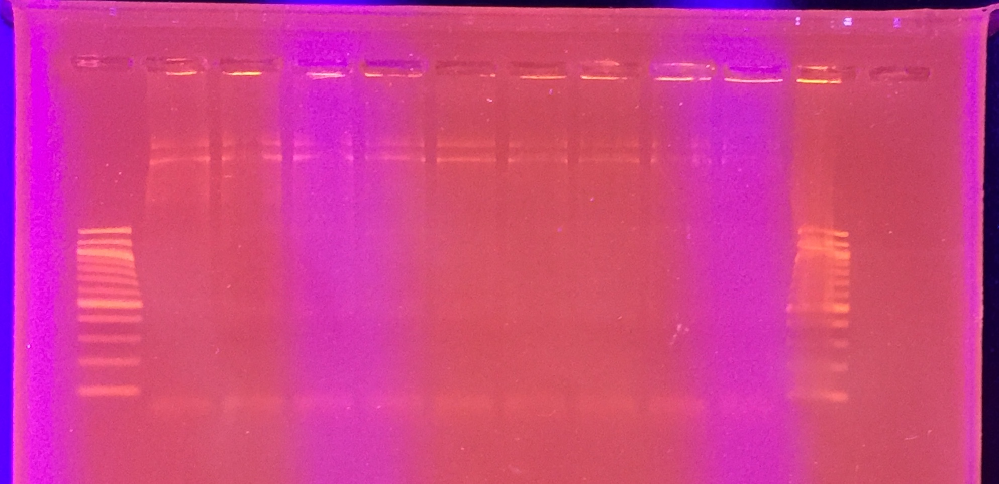

## Goals

The [last hacky-taq experiment](../20161006-hackytaq-replicates/20161006-hackytaq-replicate.md) I ran showed results that were inconsistent with the results that Vivian had from [her run](../20160920-Taq-Mn-mutagenesis/20160912-mgcl2-taq-series.md). Briefly:

1. Vivian's experiments yielded PCR products that, when Sanger-sequenced, showed on the order of 1-10 mutations across the PCR product.
1. On the other hand, my PCR products showed on the order of 100s of mutations.
1. Additionally, my no-manganese control (which I expected to have 0 to few mutations) showed hundreds of mutations as well.

I repeated the experiment with the following modifications:

1. Instead of doing triplicates, only ran single PCR reactions per concentration of manganese.
1. I had Vivian observe my setting up of the experiments.
1. I tested the following concentrations:
    1. 0.0 mM
    1. 0.05 mM
    1. 0.1 mM
    1. 0.2 mM
    1. 0.25 mM
    1. 0.30 mM
    1. 0.35 mM
    1. 0.4 mM
    1. 0.5 mM

## Gel

One possible hypothesis as to why there were poor sequencing results was because of mixed PCR products. This was raised by the Genewiz staff last week on Friday (7 October 2016). As such, I will run a gel of this PCR set.

Gel composition:

- 1% (w/v) LE agarose in TBE
- 10 µL Ethidium bromide

Loaded 5 µL of PCR product and 5 µL of gel.

Gel order (from left to right):

- 100 bp ladder
- 0.0 mM
- 0.05 mM
- 0.1 mM
- 0.2 mM
- 0.25 mM
- 0.3 mM
- 0.35 mM
- 0.4 mM
- 0.5 mM
- 100 bp ladder

Gel Image:

## Interpretation

One look at the gel and I realized what was going wrong. The melting temperature was incorrect. I had used 68ºC in this PCR round; in fact, it should have been 60ºC.

The next steps are clear: do a repeat run but with Tm at 60ºC.

I discarded the current PCR products.

## Re-run PCR

I re-ran the PCR, except this time making sure to set the Tm at 60ºC.

PCR master mix follows the composition of [previous experiment](../20161006-hackytaq-replicates/20161006-hackytaq-replicate.md), except master mix volumes are calculated for 9.9 reactions.

## Gel

Here's a gel of the PCR reaction at 60ºC.

They are all correct, so I will PCR purify the reactions and send them in for sequencing.
