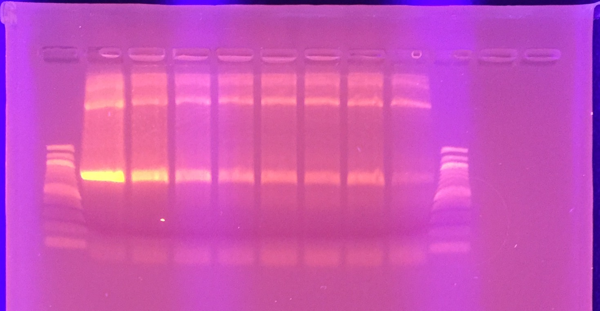
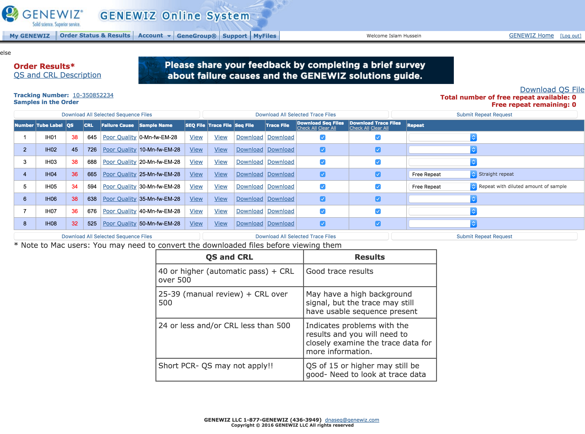

## Goals

My previous hackytaq test yielded poor sequencing results. It may be because I didn't do gel purification post-PCR, yielding mixed bands. I will try one last time today, this time doing gel purification of the PCR product.

## PCR reactions

Here are the reaction conditions recorded for convenience.

| Reagent      | 1 Rxn (µL) | MM x8.8 |
|--------------|------------|---------|
| 2X MyTaq Red | 25         | 220     |
| Water        | 17         | 149.6   |
| Mn2+         | 5          | N/A     |
| Fw Primer    | 1          | 8.8     |
| Re Primer    | 1          | 8.8     |
| Template     | 1          | 8.8     |
| Total        | 50         | 396     |

PCR Program

| Temperature | Time (min, sec) | Cycles |
|-------------|-----------------|--------|
| 95          | 1, 00           | 1      |
| 95          | 0, 15           | 40     |
| 56          | 0, 15           | 40     |
| 72          | 2, 00           | 40     |
| 72          | 10, 00          | 1      |
| 4           | inf             | n/a    |

## Gel  

After running PCR, the gel is shown below.

I excised the 800 bp band from the gel.

## Gel Purification

Gel purification was done using the Qiagen gel purification kit. Volumes used are:

| Tube | Before (g) | After (g) | Weight Gel (g) | Volume QG (µL) |
|------|------------|-----------|----------------|----------------|
| 0    | 0.97       | 1.27      | 0.3            | 900            |
| 0.1  | 0.95       | 1.17      | 0.22           | 660            |
| 0.2  | 0.94       | 1.14      | 0.2            | 600            |
| 0.25 | 0.94       | 1.1       | 0.16           | 480            |
| 0.3  | 0.96       | 1.21      | 0.25           | 750            |
| 0.35 | 0.92       | 1.14      | 0.22           | 660            |
| 0.4  | 0.93       | 1.21      | 0.28           | 840            |
| 0.5  | 0.95       | 1.19      | 0.24           | 720            |

Eluted in 12 µL, used 2 µL for measuring DNA concentration, and 10 µL for sequencing.

DNA concentrations are recorded in the [TSV file](./20161012-hackytaq-pcr-purification.tsv).

## Sequencing

Sent in the DNA for sequencing. The sequencing order is the [attached PDF](./20161012-sequencing-order.pdf)

## Sequencing Results

First off, something that looks promising:

I downloaded the data to the folder `sequencing-results-final/`. I then copied over the alignment script from before and the `victoria-pb2.fasta` file to the same directory, and ran it. This time round, the sequences were aligned perfectly. I think I can use this in the `temp-20160927-hackytaq` directory. I copied the files over and appended an `r1` to the end of the filename before the `.seq` extension, and then re-ran the hackytaq notebook.
