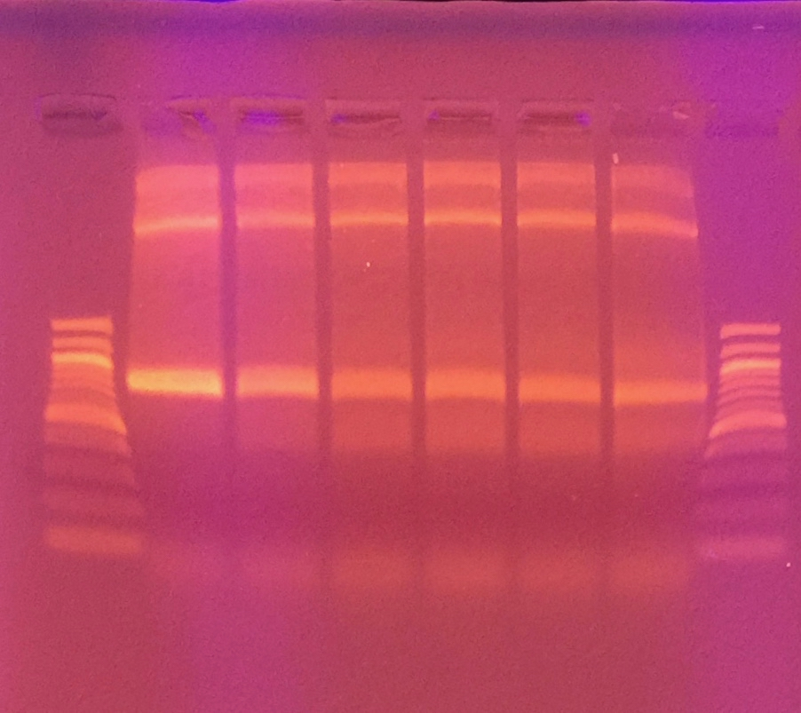

## Goals

Following the [previous results](./20161012-hackytaq-final-repeat.md), I have decided not to make that run the "final" run, but to repeat one more time to see what the number of mutations are.

As such, the goals here are:

1. Test the effect of varying concentrations of Mn2+ on the replication fidelity of MyTaq Red.

## PCR reactions

I will test the following concentrations of Mn2+:

1. 0 mM
1. 0.1 mM
1. 0.2 mM
1. 0.3 mM
1. 0.4 mM
1. 0.5 mM

A total of six reactions.

PCR Setup:

| Reagent           | 1 rxn (µL) | MM x6.6 (µL) |
|-------------------|------------|--------------|
| MyTaq Red         | 25         | 165          |
| Water             | 17         | 112.2        |
| Mn2+              | 5          | N/A          |
| Fw (EM-28)        | 1          | 6.6          |
| Re (EM-27)        | 1          | 6.6          |
| Template (VicPB2) | 1          | 6.6          |
| Total             | 50         | 297          |

Added 5 µL of 10X final concentration of MnCl2, i.e. for 0.5 mM, added 5 µL of 5 mM in 50 µL total reaction volume.

PCR Program:

| Temperature | Time (min, sec) | Cycles |
|-------------|-----------------|--------|
| 95          | 1, 00           | 1      |
| 95          | 0, 15           | 40     |
| 58          | 0, 15           | 40     |
| 72          | 2, 00           | 40     |
| 72          | 10, 00          | 1      |
| 4           | inf             | n/a    |

Let it run overnight.

## Gel

150 mL, 1% (w/v) LE agarose (i.e. 1.5 g), 15 µL EtBr.

Gel Image:

## Gel Extraction

I cut out the 800 bp band from the gel, and then used the Qiagen QIAQuick Gel Extraction kit to extract the DNA.

Here are the gel weights and volume of buffer QG added for dissolving.

| Mn2+ (mM) | Before (g) | After (g) | Gel (g) | QG Buffer (µL) |
|-----------|------------|-----------|---------|----------------|
| 0.0       | 0.93       | 1.13      | 0.20    | 600            |
| 0.1       | 0.94       | 1.13      | 0.19    | 570            |
| 0.2       | 0.94       | 1.19      | 0.25    | 750            |
| 0.3       | 0.99       | 1.14      | 0.15    | 450            |
| 0.4       | 0.94       | 1.08      | 0.14    | 420            |
| 0.5       | 0.94       | 1.10      | 0.16    | 480            |

After purification, the DNA concentrations are in the attached [TSV file](./20161018-hackytaq-pcr-purification.tsv), also copied below for convenience.

| # | Mn2+ (mM) | User name        | Date and Time         | Nucleic Acid Conc. | Unit  | A260  | A280  | 260/280 | 260/230 | Sample Type | Factor |
|---|-----------|------------------|-----------------------|--------------------|-------|-------|-------|---------|---------|-------------|--------|
| 1 | 0.0       | Eric Jinglong Ma | 10/18/2016 3:44:22 PM | 33.3               | ng/µl | 0.666 | 0.308 | 2.16    | 0.10    | DNA         | 50     |
| 2 | 0.1       | Eric Jinglong Ma | 10/18/2016 3:44:50 PM | 19.1               | ng/µl | 0.383 | 0.155 | 2.46    | 0.04    | DNA         | 50     |
| 3 | 0.2       | Eric Jinglong Ma | 10/18/2016 3:45:09 PM | 16.2               | ng/µl | 0.323 | 0.114 | 2.83    | 0.03    | DNA         | 50     |
| 4 | 0.3       | Eric Jinglong Ma | 10/18/2016 3:45:30 PM | 9.70               | ng/µl | 0.194 | 0.040 | 4.91    | 0.03    | DNA         | 50     |
| 5 | 0.4       | Eric Jinglong Ma | 10/18/2016 3:45:49 PM | 11.8               | ng/µl | 0.236 | 0.061 | 3.85    | 0.02    | DNA         | 50     |
| 6 | 0.5       | Eric Jinglong Ma | 10/18/2016 3:46:12 PM | 14.4               | ng/µl | 0.288 | 0.109 | 2.65    | 0.07    | DNA         | 50     |

Sent in for sequencing by mixing with 5 µL of EM-28.
