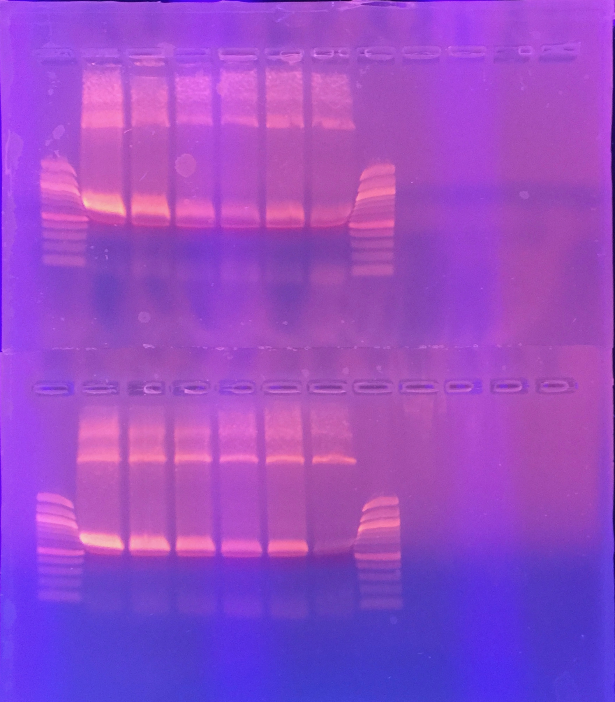

## Goals

Following the [previous results](./20161017-hackytaq-repeat.md), I will re-run to get a 3rd and 4th evaluation of the hackytaq data.

As such, the goals here are:

1. Test the effect of varying concentrations of Mn2+ on the replication fidelity of MyTaq Red.
1. This time I will do technical duplicates. The reagents are all the same, so no problems.

## PCR reactions

I will test the following concentrations of Mn2+:

1. 0 mM
1. 0.1 mM
1. 0.2 mM
1. 0.3 mM
1. 0.4 mM
1. 0.5 mM

A total of 12 reactions.

PCR Setup:

| Reagent           | 1 rxn (µL) | MM x13 (µL)  |
|-------------------|------------|--------------|
| MyTaq Red         | 25         | 325          |
| Water             | 17         | 221          |
| Mn2+              | 5          | N/A          |
| Fw (EM-28)        | 1          | 13           |
| Re (EM-27)        | 1          | 13           |
| Template (VicPB2) | 1          | 13           |
| Total             | 50         | 585          |

Added 5 µL of 10X final concentration of MnCl2, i.e. for 0.5 mM, added 5 µL of 5 mM in 50 µL total reaction volume.

PCR Program:

| Temperature | Time (min, sec) | Cycles |
|-------------|-----------------|--------|
| 95          | 1, 00           | 1      |
| 95          | 0, 15           | 40     |
| 58          | 0, 15           | 40     |
| 72          | 2, 00           | 40     |
| 72          | 10, 00          | 1      |
| 4           | inf             | n/a    |

Let it run overnight.

## Gel

On 28 October 2016, I ran the gel (1% w/v, 150 mL, 15 µL EtBr), and imaged it (picture below).

Sample order is as follows:

- Row 1: 0.0 to 0.5 mM, replicate 1
- Row 2: 0.0 to 0.5 mM, replicate 2
- Ladders are the NEB 100 bp ladder.

## Gel extraction

I cut the 800 bp band out, and followed the Qiaquick gel extraction protocol.

Tube weights and volumes:

| Tube | Before (g) | After (g) | Weight (mg) | QG (µL) | Isopropanol (µL) |
|------|------------|-----------|-------------|---------|------------------|
| 0.0  | 0.98       | 1.17      | 190         | 570     | 190              |
| 0.1  | 0.95       | 1.18      | 230         | 690     | 230              |
| 0.2  | 0.94       | 1.14      | 200         | 600     | 200              |
| 0.3  | 0.96       | 1.17      | 210         | 630     | 210              |
| 0.4  | 0.94       | 1.04      | 100         | 300     | 100              |
| 0.5  | 0.94       | 1.09      | 150         | 450     | 150              |
| 0.0  | 1.00       | 1.17      | 170         | 510     | 170              |
| 0.1  | 0.96       | 1.14      | 180         | 540     | 180              |
| 0.2  | 0.99       | 1.18      | 190         | 570     | 190              |
| 0.3  | 0.94       | 1.10      | 160         | 480     | 160              |
| 0.4  | 0.97       | 1.12      | 150         | 450     | 150              |
| 0.5  | 0.94       | 1.05      | 110         | 330     | 110              |

I didn't bother identifying which was replicate 1 and replicate 2, as they were conducted on the same day, and it's the concentration that I'm most interested in, not the replicate number.

Eluted in 12 µL EB.

## DNA concentrations

The DNA concentrations are attached [here](./20161028-hackytaq-pcr-purification.tsv). For convenience, also displayed below.

| #  | Sample ID | User name        | Date and Time         | Nucleic Acid Conc. | Unit  | A260  | A280  | 260/280 | 260/230 | Sample Type | Factor |
|----|-----------|------------------|-----------------------|--------------------|-------|-------|-------|---------|---------|-------------|--------|
| 1  | R1-0.0    | Eric Jinglong Ma | 10/28/2016 1:22:18 PM | 25.7               | ng/µl | 0.515 | 0.216 | 2.39    | 0.13    | DNA         | 50.00  |
| 2  | R1-0.1    | Eric Jinglong Ma | 10/28/2016 1:22:59 PM | 26.6               | ng/µl | 0.533 | 0.233 | 2.28    | 0.09    | DNA         | 50.00  |
| 3  | R1-0.2    | Eric Jinglong Ma | 10/28/2016 1:23:21 PM | 14.7               | ng/µl | 0.295 | 0.110 | 2.68    | 0.08    | DNA         | 50.00  |
| 4  | R1-0.3    | Eric Jinglong Ma | 10/28/2016 1:23:41 PM | 12.2               | ng/µl | 0.243 | 0.075 | 3.24    | 0.14    | DNA         | 50.00  |
| 5  | R1-0.4    | Eric Jinglong Ma | 10/28/2016 1:24:03 PM | 7.7                | ng/µl | 0.155 | 0.039 | 3.99    | 0.12    | DNA         | 50.00  |
| 6  | R1-0.5    | Eric Jinglong Ma | 10/28/2016 1:24:24 PM | 9.0                | ng/µl | 0.181 | 0.056 | 3.22    | 0.04    | DNA         | 50.00  |
| 7  | R2-0.0    | Eric Jinglong Ma | 10/28/2016 1:24:46 PM | 48.9               | ng/µl | 0.978 | 0.531 | 1.84    | 0.21    | DNA         | 50.00  |
| 8  | R2-0.1    | Eric Jinglong Ma | 10/28/2016 1:25:07 PM | 21.8               | ng/µl | 0.435 | 0.190 | 2.29    | 0.14    | DNA         | 50.00  |
| 9  | R2-0.2    | Eric Jinglong Ma | 10/28/2016 1:25:26 PM | 17.1               | ng/µl | 0.342 | 0.140 | 2.44    | 0.09    | DNA         | 50.00  |
| 10 | R2-0.3    | Eric Jinglong Ma | 10/28/2016 1:25:45 PM | 12.6               | ng/µl | 0.252 | 0.080 | 3.13    | 0.03    | DNA         | 50.00  |
| 11 | R2-0.4    | Eric Jinglong Ma | 10/28/2016 1:26:03 PM | 12.7               | ng/µl | 0.254 | 0.081 | 3.14    | 0.04    | DNA         | 50.00  |
| 12 | R2-0.5    | Eric Jinglong Ma | 10/28/2016 1:26:23 PM | 4.4                | ng/µl | 0.089 | 0.004 | 25.12   | 0.04    | DNA         | 50.00  |

I then sent the PCR products for sequencing with EM-28. [[Sequencing order](./20161028-sequencing-order.pdf)]
